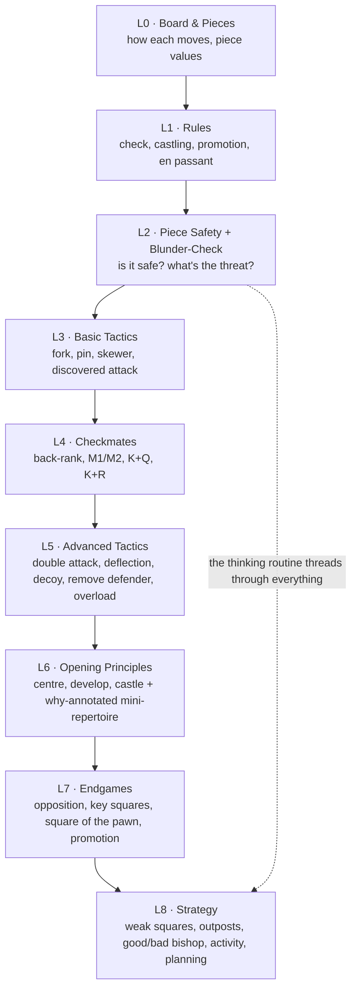
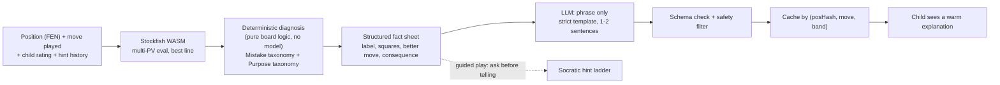

# Loci — Chess Module (Gambit) Build Spec

Companion to Master PRD v3.2, §4.2. This turns the chess module from prose into an implementable structure. It answers two things: **how the learning is structured** (a sequenced ladder with mastery gates), and **how the AI tutor teaches and explains mistakes** (engine does the analysis, the model only phrases it).

> Sourcing note: built from the Lotus Chess site, established beginner-chess pedagogy, and the methods of *How to Win at Chess* (Levy Rozman) and *Logical Chess: Move by Move* (Irving Chernev). Video content was not used (can't process video). Book learnings are adopted as method, in our own words.

---

## 1. What to take from Lotus — and what to invert

**Adopt Lotus's mechanics:**

- **A sequenced path**, not a grab-bag of positions — the learner always knows the next step.
- **Mastery via spaced repetition** — drill a pattern over time until it's automatic, rather than just showing more new positions.
- **Weakness-driven adaptivity** — detect what the learner gets wrong and target it.
- **Honest progress tracking** — a real, moving rating and per-area win/solve rates.
- **Learn by doing** — guided line-by-line, then practise.

**Invert Lotus's content emphasis for kids 8–12:**

- Lotus is **openings-first for all levels**. That is wrong for beginners: children lose by **hanging pieces and missing threats**, not by weak opening theory. Loci is **fundamentals-first** — openings appear at Level 6 as *principles*, never memorised lines.
- Lotus's most-cited weakness is teaching moves with **no explanation of why**. Loci's tutor exists to fix exactly that: every move — good or bad — can be explained.

---

## 2. The Path — the structured learning ladder

The core of "make it structured." Nine levels, each gated by demonstrated mastery. A child cannot skip ahead by clicking; they advance by *proving* the skill.



Every level has the same four-part structure:

| Part | What it is | Mechanic |
| --- | --- | --- |
| **Learn** | Short lessons teaching the concept (companion-narrated, minimal reading) | Concept → worked example → try-it |
| **Drill** | Curriculum-linked puzzles for that level | Each pattern goes on the **SRS**, drilled until automatic (Section 3) |
| **Apply** | A **Boss Game** vs a persona that showcases the level's theme | Beat it to earn the belt |
| **Gate** | A mastery check: solve the level's pattern set at ≥ 80% first-try **and**, from L2 on, use the blunder-check unprompted in a guided game | Advancement is earned and measurable |

This is the Lotus "structured path + mastery over time" applied to fundamentals instead of openings.

---

## 3. The mastery engine (spaced repetition for chess)

Every tactic pattern, checkmate pattern, and (later) opening move the child learns becomes an **SRS item** on the shared spine (PRD §5, Appendix E). It graduates only when the child solves it correctly at increasing intervals — this is what "mastery over time" means, and it's why patterns become automatic rather than one-shot lessons.

- A puzzle theme (e.g. "knight fork") is a family of SRS items; the child sees fresh positions of that theme at review, not the same position twice.
- Review positions are pulled from the puzzle store filtered by theme + the child's band + due date.
- A failed review re-shortens the interval; a solved one lengthens it (SM-2 class, shared with Memora/Lexicon).

---

## 4. Adaptivity — weakness-driven (Lotus's core, done privately)

Every mistake the tutor diagnoses (Section 5) is logged **by taxonomy category** to a local weakness profile. The next puzzle and lesson selection is weighted toward the child's weakest categories.

- "You've hung pieces 4 times this week" → the app schedules a **piece-safety session** and biases Puzzle Path toward undefended-piece and counting puzzles.
- Weakness detection runs **only on the child's own games played inside Loci** — never on imported Chess.com/Lichess accounts (children don't have them, and it keeps the module PII-free and offline; PRD §5.8).
- The weakness profile is local-first (Appendix E extension in Section 8), never sent to a server.

---

## 5. The AI Tutor — architecture

The tutor does two jobs: **teach how to play** (proactive) and **explain what went wrong and why** (reactive). Both rest on one non-negotiable principle:

> **The chess engine and deterministic code do ALL the analysis. The language model only phrases verified facts into warm, child-friendly words. The model never evaluates a position, never picks a move, never invents chess analysis.**

This is the quality and safety guarantee — LLMs are unreliable at legal-move and evaluation reasoning, so they are kept entirely out of the analysis path. It also makes explanations cacheable and cheap.



### Stage 1 — Engine evaluation (Stockfish WASM)

- Analyse the position at fixed `movetime` (or depth), `MultiPV = 3–4`, in a Web Worker so the UI never blocks.
- Capture: eval of the position before the move, eval after the child's move, eval of the engine's best move, and the top lines (principal variations).
- `delta = eval(best_move) − eval(played_move)` → drives severity.
- For **play** (Play the Bot), run the same engine strength-limited (`Skill Level` / `UCI_LimitStrength`) so bots err plausibly; for **analysis/tutoring**, run full strength.

### Stage 2 — Deterministic diagnosis (the heart; no model)

Pure functions over the board (use a chess move-generation library, e.g. chess.js, for legality, attacks, and defenders). Two taxonomies:

**Mistake taxonomy (why a move was bad):**

- `hung_piece` — after the move, one of the child's pieces is attacked and undefended, or the lowest attacker is worth less than the piece.
- `missed_free_capture` — a free (undefended) enemy piece was available and not taken.
- `missed_tactic` — the engine's best line contains a fork / pin / skewer / mate the child had and missed.
- `walked_into_tactic` — the opponent's best reply now forks/pins/skewers the child.
- `ignored_threat` — an existing opponent threat is not addressed by the move.
- `weakened_king` — the move exposes the king (opens the shelter, moves a defender).
- `lost_tempo` — moves an already-developed piece for no gain, or retreats without cause.
- `bad_trade` — a capture/exchange that loses material by value counting.

**Purpose taxonomy (why a move is good — the Chernev method):**

- `develops_piece`, `controls_centre`, `improves_worst_piece`, `creates_threat`, `defends_threat`, `opens_file_for_rook`, `gains_space`, `restricts_enemy_piece`, `prepares_castling`.

Representative logic (illustrative, not final):

```ts
function detectHungPiece(boardAfterMove, sideToMoveWas): Finding | null {
  for (const p of ownPieces(boardAfterMove, sideToMoveWas)) {
    const attackers = attackersOf(boardAfterMove, p.square, enemy(sideToMoveWas))
    const defenders = attackersOf(boardAfterMove, p.square, sideToMoveWas)
    if (attackers.length === 0) continue
    const cheapestAttacker = minValue(attackers)
    if (defenders.length === 0 || cheapestAttacker < value(p)) {
      return { label: 'hung_piece', squares: [p.square, cheapestAttacker.square],
               piece: p.type, consequence: `loses the ${p.type}` }
    }
  }
  return null
}
```

Output is a **structured fact sheet**: `{ classification, severity, squaresInvolved, betterMove, betterMovePurpose, concreteConsequence }`. Everything downstream uses only this — never the raw engine output.

### Stage 3 — Explanation (LLM phrases verified facts)

- Input: the fact sheet **only**, plus the child's band for tone. No board, no eval numbers, no open prompt.
- Output: one or two warm sentences. Example the model should produce from a `hung_piece` fact sheet:
  *"Your knight moved to a square where the bishop can take it for free. Before you move, check who can capture the square you're landing on."*
- Structured-output + schema check; if it fails, serve an authored fallback for that classification (never raw model text).
- Safety-filtered like all generated text (PRD §5.5).
- **Cache** by `(positionHash, move, band)`. The few hundred most common beginner mistakes and the standard good-move purposes are **pre-generated** — this is the highest cache-hit surface in the app, so live calls are rare.

### Stage 4 — Teaching how to play (proactive)

- **Lessons** (per level) teach concepts with worked examples; the companion narrates.
- **Purpose explanations** — the tutor explains why a *good* move is good (purpose taxonomy), not only why a bad move is bad. This is the depth Lotus lacks.
- **Socratic hint ladder** in guided play — ask before telling: "Something of yours is in danger — can you spot it?" → "Look at your knight." → full explanation. Depth adapts to the child's hint history.
- **The blunder-check overlay** (Rozman) — a scaffolded pre-move checklist (is it safe? what's threatened? anything undefended? a better move?) that **fades** as the child internalises it.

### Stage 5 — Explaining the game (post-game review)

- Find the **three biggest eval swings** — the key moments.
- Each is replayable with its explanation (mistake or purpose).
- End with **one thing done well** (purpose taxonomy) and **one pattern to practise** → generates a themed puzzle set and adds SRS items.

### Stage 6 — Annotated Game Replay (the Chernev mode)

- Step or auto-play through a curated complete game; the tutor gives the **purpose of each move** in child language; **pause-and-predict** ("what would you play here?") before revealing.
- Games grouped by theme (a kingside attack, a centre squeeze).
- Annotations are **authored or engine-plus-taxonomy-generated, then validated** — never free-generated — so they are always correct.

---

## 6. Modes (structured)

| Mode | Purpose | Notes |
| --- | --- | --- |
| **Learn** | Level lessons | Concept → example → try-it; companion-narrated |
| **Puzzle Path** | Drill patterns to mastery | Lichess CC0 puzzles, filtered + re-rated; SRS-backed |
| **Play the Bot** | Practise full games | Strength-limited human-like personas, a rising ladder |
| **Guided Game** | Play with a coach | Blunder-check overlay + optional Socratic nudges |
| **Annotated Replay** | Learn from whole games | Chernev-style per-move purpose, pause-and-predict |
| **Review** | Retain + fix weaknesses | Due SRS items + a weakness-targeted session |
| **Daily Puzzle** | The Hub daily challenge | One puzzle, shareable glyph result |

---

## 7. Engine integration (Stockfish WASM) — specifics

- Use **Stockfish compiled to WebAssembly** (stockfish.wasm / lila-stockfish-web lineage). Run it in a **Web Worker**; talk UCI over `postMessage`.
- Config: `setoption name MultiPV value 3`; analysis `go movetime 800–1200`; play `setoption name Skill Level value N` (or `UCI_LimitStrength` + `UCI_Elo`) mapped to each persona.
- Parse `info depth … score cp X | score mate N … pv …` for evals and lines; `bestmove` for the top move.
- **Offline:** cache the WASM + glue JS via the service worker after first load; Gambit then works fully offline (PRD NFRs §5.9). No WASM support on a device → show a friendly "chess needs a newer browser," rest of the ecosystem unaffected.
- Keep engine strength for play modest for the youngest band; the goal is a beatable, human-feeling opponent, not a crusher.

---

## 8. Chess data model (local-first)

Extends Appendix E; all local, internal rating computed on-device.

```ts
interface ChessLesson {
  id: string; level: number; conceptId: string;
  steps: LessonStep[];            // concept, worked example, try-it position (FEN)
  packVersion: string; validated: true;
}

interface ChessPuzzle {
  id: string; fen: string; solutionUci: string[];   // the line
  themes: string[];               // 'fork','pin','backRankMate',...
  rating: number;                 // internal, re-rated from our solve data
  level: number; packVersion: string; validated: true;
}

interface AnnotatedGame {
  id: string; pgn: string; theme: string;
  annotations: { ply: number; purpose: string; text: string }[];  // validated, not free-gen
  packVersion: string; validated: true;
}

interface MoveDiagnosis {              // Stage 2 output, logged
  gameId: string; ply: number;
  classification: string;             // taxonomy label
  severity: 'inaccuracy'|'mistake'|'blunder'|'good';
  squares: string[]; betterMove?: string; consequence?: string;
}

interface MistakeLogEntry {            // feeds adaptivity (Section 4)
  profileId: string; category: string; at: number;
}

interface ChessSrsItem {               // maps onto shared SrsItem
  id: string; profileId: string; theme: string;
  payloadRef: string;                 // a puzzle id / pattern
  ease: number; intervalDays: number; dueAt: number;
}

interface PlayerChessProfile {
  profileId: string; internalRating: number;   // computed on-device from play/puzzles
  weakness: Record<string, number>;            // category -> recent error weight
  blunderCheckUsage: number;                    // rises then plateaus as internalised
}

interface BotPersona {
  id: string; name: string; engineSkill: number; style: string;  // 'aggressive','solid'
}
```

---

## 9. Content sources & pipeline

- **Puzzles:** the **Lichess open puzzle database (CC0)** — filter to child rating bands and themes, re-rate internally from our own solve data.
- **Annotated games & lessons:** authored or engine-plus-taxonomy-generated, then **validated** (see below).
- Everything flows through the content pipeline in the Backend Build Guide §7: **generate → validate → versioned pack → R2 → service-worker cache**. Chess-specific validation gates:
  - Every puzzle is checked by the engine for a **unique winning line** at the stated difficulty.
  - Every annotation is checked against the **engine + taxonomy** — no free-generated analysis ships.
  - Every explanation string passes the **safety filter**.

---

## 10. Acceptance criteria & tests

- Engine runs fully client-side and offline after first load.
- **Diagnosis correctness:** an automated suite of scripted games asserts the right taxonomy label and the right squares, with **zero hallucinated squares** — a hung queen is always caught, a good developing move is correctly labelled by purpose.
- Puzzles are solvable and correctly rated; annotations validate.
- **Pedagogical bar:** a complete beginner, using only the Path, reaches "can checkmate with K+Q vs K" and "uses the blunder-check unprompted."
- **Repeat-mistake rate falls per taxonomy category** over time — the direct measure that the tutor is teaching, not just narrating.

---

## 11. Build order

1. **Board, pieces, rules, and Stockfish WASM integration** (Web Worker, UCI, offline cache) — you can play a game vs a strength-limited bot. *(foundation)*
2. **The diagnosis engine** — the two taxonomies as pure functions + the scripted-game test suite. This is the differentiator; build it before the explanation layer. *(the heart)*
3. **The explanation layer** — fact sheet → LLM phrasing → schema + safety + cache; pre-generate common beginner mistakes.
4. **Puzzle Path + SRS** — import and re-rate Lichess puzzles; wire the mastery engine.
5. **The Path (levels + lessons + gates)** — the structured ladder.
6. **Guided Game + the blunder-check overlay** — the thinking routine.
7. **Annotated Game Replay** — authored/validated games, pause-and-predict.
8. **Adaptivity** — mistake log → weakness profile → weighted selection.
9. **Review mode + Daily Puzzle** — retention + the Hub hook.

Steps 3, 7, and the puzzle import all depend on the content pipeline, so stand that up (Backend Build Guide §7) alongside step 2.
